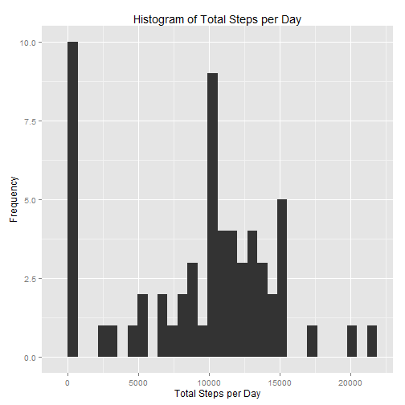
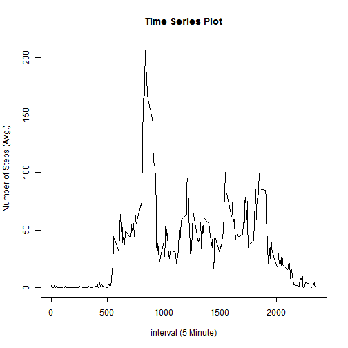
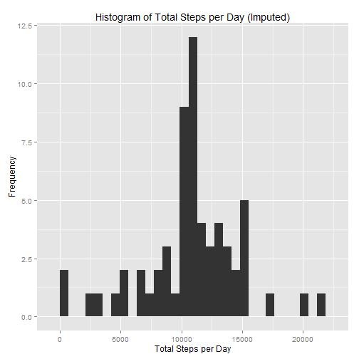
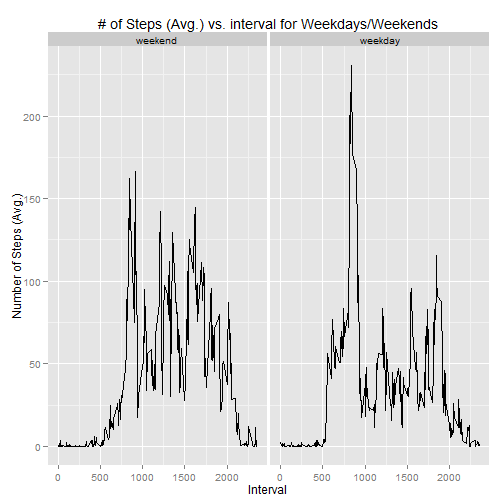

Reproducible Research: Peer Assessment 1
========================================================
Activity monitoring data analysis
--------------------------------------------------------

### Loading and preprocessing the data

We load the data using the url with `download.file()` and unzip & read the data with `read.table()`. Lastly, we save the data into an object called activity.


```r
# Read in data by unzipping file and loading via read.table
temp <- tempfile()
download.file("http://d396qusza40orc.cloudfront.net/repdata%2Fdata%2Factivity.zip", 
    temp)
activity <- read.table(unz(temp, "activity.csv"), sep = ",", header = TRUE)
unlink(temp)
```


We pre-process the data to create a time variable from the date and interval variables


```r
activity$time <- strptime(paste(activity$date, sapply(activity$interval, formatC, 
    width = 4, flag = 0)), format = "%Y-%m-%d %H%M")
```


### What is mean total number of steps taken per day?

We make a histogram of the total number of steps taken each day._s_ is the total number of steps, _d_ is the unique dates. We combine these vectors into a data frame called _df_ that is then used to plot a histogram of the total number of steps taken each day.

```r
s <- as.vector(tapply(activity$steps, activity$date, sum, na.rm = T))
d <- unique(activity$date)
df <- data.frame(cbind(d, s))
# Load ggplot2 package
library(ggplot2)
ggplot(data = df, aes(x = s)) + geom_histogram(stat = "bin") + xlab("Total Steps per Day") + 
    ylab("Frequency") + ggtitle("Histogram of Total Steps per Day")
```

```
## stat_bin: binwidth defaulted to range/30. Use 'binwidth = x' to adjust this.
```

 


The mean of the total number of steps per day is 9354 & the median is 10395.


```r
mean(s)
```

```
## [1] 9354
```

```r
median(s)
```

```
## [1] 10395
```


### What is the average daily activity pattern?
A time series plot (i.e. type = "l") of the 5-minute interval (x-axis, the _i_ vector) and the average number of steps taken, averaged across all days (y-axis, the vector _avgSteps_ ) is presented.


```r
avgSteps <- as.vector(tapply(activity$steps, activity$interval, mean, na.rm = T))
i <- unique(activity$interval)
df2 <- data.frame(cbind(i, avgSteps))
plot(x = df2$i, y = df2$avgSteps, type = "l", xlab = "interval (5 Minute)", 
    ylab = "Number of Steps (Avg.)", main = "Time Series Plot")
```

 


The 5-minute interval that, on average across all the days in the dataset, contains the maximum number of steps is _08:35_.


```r
df2$i[which.max(df2$avgSteps)]
```

```
## [1] 835
```


### Imputing missing values

The total number of missing values in the dataset is 2304.

```r
sum(is.na(activity))
```

```
## [1] 2304
```


We devise a strategy to fill in missing values from the original dataset. NA's will be filled by the average number of steps for the particular 5 minute interval that is missing where we make use of the previously created _avgSteps_ vector. The fully imputed dataset is called _new_. Lastly, we plot the histogram of the total number of steps taken each day with
the imputed dataset.


```r
# Create a copy of the original dataset
temp <- tempfile()
download.file("http://d396qusza40orc.cloudfront.net/repdata%2Fdata%2Factivity.zip", 
    temp)
new <- read.table(unz(temp, "activity.csv"), sep = ",", header = TRUE)
unlink(temp)
# pre-process the new dataset
new$time <- strptime(paste(new$date, sapply(new$interval, formatC, width = 4, 
    flag = 0)), format = "%Y-%m-%d %H%M")

# Create a vector called impute which is needed for the subsequent for loop
# to impute the variable 'steps'
impute <- rep(round(avgSteps), 61)
# Loop to impute the NA with the average steps by interval
for (i in 1:nrow(new)) {
    if (is.na(new[i, 1])) {
        new[i, 1] = impute[i]
    } else {
        next
    }
}

# Create data frame to plot the histogram of the total steps per day
s.new <- as.vector(tapply(new$steps, new$date, sum, na.rm = T))
d.new <- unique(new$date)

df.new <- data.frame(cbind(d.new, s.new))

ggplot(data = df.new, aes(x = s.new)) + geom_histogram(stat = "bin") + xlab("Total Steps per Day") + 
    ylab("Frequency") + ggtitle("Histogram of Total Steps per Day (Imputed)")
```

```
## stat_bin: binwidth defaulted to range/30. Use 'binwidth = x' to adjust this.
```

 


The mean and median total number of steps taken per day are 10766 and 10762 respectively. These values do differ from the estimates from the first part of the assignment. The impact of imputing missing data on the estimates of the total daily number of steps is that it increased the mean by a great extent and the median to a lower extent and now the mean and median are close to one another. The distribution in the histogram appears more symmetric as well with the imputed data.


```r
# The mean of the total number of steps per day is
mean(s.new)
```

```
## [1] 10766
```

```r
# The median of the total number of steps per day is
median(s.new)
```

```
## [1] 10762
```


### Are there differences in activity patterns between weekdays and weekends?

First we create a new factor variable in the dataset with two levels - "weekday" and "weekend" indicating whether a given date is a weekday or weekend day.

Then we make a panel plot containing a time series plot of the 5-minute interval (x-axis) and the average number of steps taken, averaged across all weekday days or weekend days (y-axis).

From the plot, we see that for the mostpart activity is greater throughout the day for the weekends when compared to the weekdays. Weekdays show the greatest amount of activity just before 9am and around 6-7pm.


```r
new$wkdaytyp <- ifelse(weekdays(new$time) == "Saturday" | weekdays(new$time) == 
    "Sunday", "weekend", "weekday")

weekend <- subset(new, new$wkdaytyp == "weekend")
we.avgSteps <- round(as.vector(tapply(weekend$steps, weekend$interval, mean, 
    na.rm = T)), 1)
we.i <- unique(weekend$interval)
we.typ <- rep("weekend", length(we.i))

df.we <- data.frame(cbind(we.i, we.avgSteps, we.typ))
names(df.we) <- c("interval", "NumberofSteps", "dayType")

weekday <- subset(new, new$wkdaytyp == "weekday")
wd.avgSteps <- round(as.vector(tapply(weekday$steps, weekday$interval, mean, 
    na.rm = T)), 1)
wd.i <- unique(weekday$interval)
wd.typ <- rep("weekday", length(we.i))

df.wd <- data.frame(cbind(wd.i, wd.avgSteps, wd.typ))
names(df.wd) <- c("interval", "NumberofSteps", "dayType")

df3 <- rbind(df.we, df.wd)

df3$NumberofSteps <- as.numeric(as.character(df3$NumberofSteps))
df3$interval <- as.numeric(as.character(df3$interval))


ggplot(df3, aes(interval, NumberofSteps)) + geom_line() + facet_grid(. ~ dayType) + 
    xlab("Interval") + ylab("Number of Steps (Avg.)") + ggtitle("# of Steps (Avg.) vs. interval for Weekdays/Weekends")
```

 


